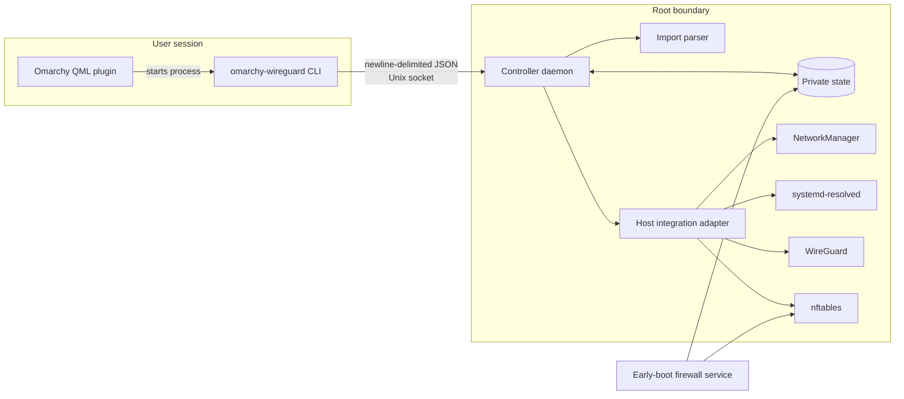
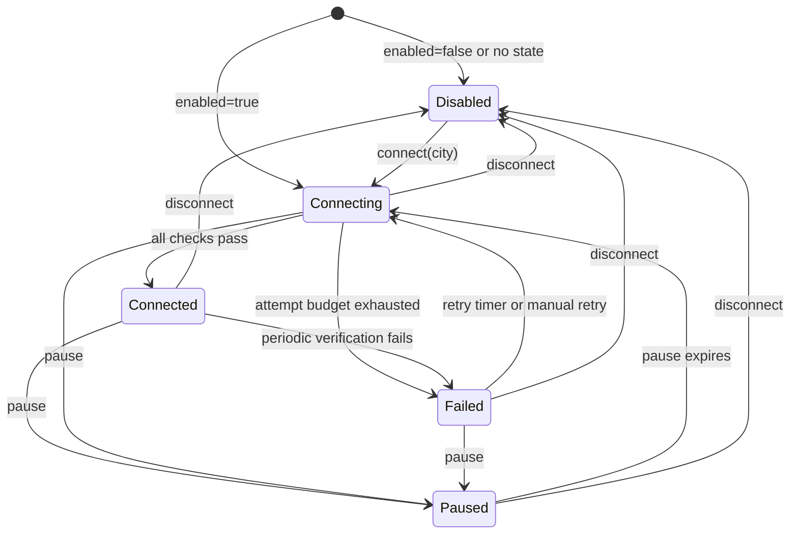

# Architecture

This document describes the implemented architecture of `omarchy-wireguard`,
including its privilege boundaries, networking policy, persistent state, and
failure behavior. It is intended for maintainers and reviewers of the security
model. User-facing installation and operation are documented in
[README.md](README.md).

## Design goals

- Keep the Omarchy UI and command-line client unprivileged.
- Delegate WireGuard profile and host networking changes to a small root daemon.
- Fail closed whenever VPN use is enabled but a verified tunnel is unavailable.
- Cover traffic originating from the host, Docker bridges, and VM bridges.
- Preserve directly connected LAN access, `.lan` DNS, local discovery, and the
  explicitly supported `alfred-vpn` route.
- Avoid modifying unrelated VPN profiles, UFW configuration, or nftables tables.
- Keep WireGuard secrets out of plugin state, logs, status responses, and
  diagnostics.

The plugin does not implement WireGuard, DNS resolution, or policy routing. It
configures and verifies NetworkManager, systemd-resolved, WireGuard, and
nftables, which remain responsible for those functions.

## System overview



The runtime control path is:

```text
BarWidget.qml / Service.qml
    -> /usr/bin/omarchy-wireguard
    -> /run/omarchy-wireguard/control.sock
    -> root controller daemon
    -> NetworkManager, systemd-resolved, WireGuard, routing, and nftables
```

## Components

| Component | Privilege | Responsibility |
| --- | --- | --- |
| `plugin/BarWidget.qml` | User | Status indicator, location panel, controls, and import review UI |
| `plugin/Service.qml` | User | Polling, CLI process execution, transition notifications, and backend installation entry point |
| `plugin/Model.js` | User | Pure status/catalog normalization and filtering |
| `bin/omarchy-wireguard` | User, except emergency disable | JSON client, additive import staging, named-profile selection, and root-only emergency recovery |
| `daemon.py` | Root | Socket ownership, peer authentication, request dispatch, periodic state-machine ticks, and early-firewall entry point |
| `controller.py` | Root | Persistent intent, runtime state machine, retries, additive imports, and connection sequencing |
| `importer.py` | Root | Strict WireGuard parsing, archive validation, and location inference |
| `system.py` | Root | Narrow adapter around `nmcli`, `wg`, `ip`, `resolvectl`, `nft`, and `getent` |
| `nftables.py` | Root | Rendering the dedicated kill-switch table |
| `storage.py` | Root | Private, atomic JSON persistence |

The backend invokes commands as argument arrays without a shell. Untrusted
profile data is parsed and validated before it reaches a host command.

## Installation and boot

The UI starts `scripts/install-backend` through Polkit. The installer places:

```text
/usr/bin/omarchy-wireguard
/usr/lib/omarchy-wireguard/backend/
/usr/lib/omarchy-wireguard/integrate-user
/usr/lib/omarchy-wireguard/uninstall-backend
/usr/lib/systemd/system/omarchy-wireguard.service
/usr/lib/systemd/system/omarchy-wireguard-firewall.service
/etc/omarchy-wireguard/backend.conf
```

`backend.conf` contains the numeric UID permitted to control the daemon. The
installer also adds a NetworkManager dependency drop-in so the early firewall
is reconciled before NetworkManager starts.

The services have distinct roles:

- `omarchy-wireguard-firewall.service` is a one-shot unit ordered before
  `network-pre.target` and NetworkManager. It reads persisted intent and creates
  a conservative firewall before networking becomes available.
- `omarchy-wireguard.service` is the long-running controller. It starts after the
  firewall service and NetworkManager, enriches the firewall with discovered
  host context, and attempts the selected connection.

At early boot, missing or valid disabled state permits direct networking unless
a physical DNS restoration is still pending. Pending restoration, valid enabled
state, and malformed, unreadable, or unsafe state install a fail-closed policy
so corruption or an interrupted disconnect cannot silently open the network.

The nftables table remains in the kernel if the controller crashes. The daemon
uses `Restart=on-failure`, but safety does not depend on a successful restart.

## Control protocol and authorization

The daemon listens on `/run/omarchy-wireguard/control.sock`. The socket is owned
by root, group-owned by the controller user's primary group, and mode `0660`.
Filesystem permissions are not the final authorization boundary: the daemon
reads `SO_PEERCRED` from every accepted connection and permits only root or the
configured numeric controller UID.

Each connection carries exactly one newline-terminated JSON request:

```json
{"op":"status","args":{},"request_id":"opaque"}
```

Unknown fields, multiple requests, malformed payloads, and messages over 256
KiB are rejected. Supported operations are `status`, `list`, `import`,
`connect`, `disconnect`, `retry`, `pause`, and `diagnostics`. The daemon is
single-threaded and processes one request per connection. Between socket events
it advances the state machine approximately every two seconds.

Expected validation failures are returned as `rejected`. Unexpected exceptions
return a generic internal error; subprocess stderr is not exposed because it
may contain configuration details.

## Persistent data

Root-owned state is stored below `/var/lib/omarchy-wireguard`:

| File | Contents |
| --- | --- |
| `state.json` | Enabled intent, target city, and profile most-recently-used order |
| `profiles.json` | Non-secret profile metadata and NetworkManager UUIDs |
| `network.json` | LAN resolvers and validated `alfred-vpn` exceptions |
| `dns.json` | Original physical-link DNS domains and default-route state while protection is enabled |
| `notification.json` | Latest privacy-safe backend notification |

The directory is mode `0700`. Files are written through mode-`0600` temporary
files, flushed, atomically replaced, and followed by a directory flush. Reads
reject symlinks, non-regular files, and unexpected ownership.

Runtime details such as the active interface, mode, checks, retry count, retry
deadline, and pause deadline are deliberately not persisted. In particular, a
daemon restart during a pause returns to the persisted enabled intent and
reconnects fail closed rather than restoring an open pause.

## State machine



The modes have these network semantics:

| Mode | Persisted enabled intent | Managed tunnel | Kill switch |
| --- | --- | --- | --- |
| `disabled` | No | Down | Removed |
| `paused` | Yes | Down | Removed intentionally |
| `connecting` | Yes | Starting or down | Active |
| `connected` | Yes | Up and verified | Active |
| `failed` | Yes | Down | Active |

One connection attempt has a shared 20-second budget across all profiles for a
city and their verification. Profiles are tried in most-recently-used order.
Failures retry after 2, 4, 8, 16, and subsequent exponentially increasing
delays, capped at 300 seconds. A manual retry resets the backoff.

## Connection sequence

Connecting is deliberately ordered to avoid a temporary direct path:

1. Persist enabled intent and the target city.
2. Deactivate all managed profiles.
3. Discover physical default-route interfaces, directly connected LAN routes,
   bridge topology, and physical-link DNS state.
4. Persist the original physical-link DNS domains and default-route settings.
5. Replace physical-link route domains with only `~lan`, set their DNS
   default-route status to `no`, and install the fail-closed firewall.
6. Resolve the selected WireGuard endpoint while only approved resolver traffic
   is allowed on the underlay.
7. Replace the firewall with exact endpoint IP and UDP-port exceptions.
8. Activate the NetworkManager WireGuard profile.
9. Reassert tunnel and physical-link DNS because activation may republish DNS.
10. Replace the firewall with the active tunnel interface included.
11. Poll all connection checks until they pass or the attempt budget expires.

If verification fails, the controller deactivates managed profiles, restores a
fail-closed firewall without tunnel allowances, enters `failed`, and schedules
a retry. A connected tunnel is periodically reverified and follows the same
failure path if any check stops passing.

## NetworkManager and WireGuard

Imported profiles receive:

- An `omarchy-wireguard-` connection-name prefix.
- A deterministic `owg-...` interface name.
- Disabled NetworkManager autoconnect.
- Permission for the configured controller user.
- WireGuard fwmark `0x6f7467`.
- IPv4 default-route intent and DNS priority.
- The `~.` DNS route domain.

The backend does not create routing tables or `ip rule` entries directly. It
relies on NetworkManager's WireGuard handling of `AllowedIPs` and the fwmark,
then verifies the resulting route by probing `1.1.1.1`. The fwmark is also
required by the nftables exception that lets encrypted WireGuard packets reach
the exact endpoint over a physical interface.

Managed-profile operations are scoped to the `omarchy-wireguard-` prefix. Other
NetworkManager connections are not activated, deactivated, or deleted.

## DNS architecture

The DNS policy uses systemd-resolved route domains:

- The active WireGuard interface receives the profile's literal DNS servers,
  `~.`, and default-route status. It is therefore preferred for general DNS.
- Physical links retain their existing DNS servers but receive only `~lan` and
  `DefaultRoute=no`, keeping local names on the LAN resolver without competing
  with the tunnel for general queries.
- The firewall allows the `systemd-resolve` service user to contact only the
  discovered, exact physical-link resolver addresses on TCP/UDP port 53.

Before changing a physical link, the backend persists its original domains and
default-route value. Retries and daemon restarts retain that snapshot. On
disconnect, pause, disabled boot, or emergency disable, tunnel DNS is reverted
and the exact physical-link snapshot is restored before it is cleared.

## Kill-switch architecture

The backend owns one table, `inet omarchy_wireguard`. It does not modify UFW or
unrelated nftables tables. The table contains output and forward base chains at
priority `-10`, both with default policy `drop`. There is no input chain.

### Host output

The output chain allows only:

- Loopback.
- Traffic through the selected WireGuard tunnel.
- Marked WireGuard UDP transport to exact WireGuard endpoints over a physical
  interface.
- Root-owned WireGuard transport to validated `alfred-vpn` endpoints.
- Directly connected LAN destinations over verified physical interfaces.
- DHCP, mDNS, SSDP, and required IPv6 neighbor/router discovery.
- systemd-resolved DNS to exact physical-link LAN resolvers.
- Validated private prefixes through the literal `alfred-vpn` interface.

Everything else is dropped. There is intentionally no general
established/related output allowance that could preserve a direct connection
after the VPN route disappears.

### Docker and VM forwarding

The forward chain discovers Linux bridge interfaces and their member
interfaces. This covers conventional Docker and VM bridge networking without
calling Docker or a hypervisor API. It allows:

- Traffic among local bridge interfaces.
- Local guests to directly connected LAN prefixes, with return traffic limited
  to established or related flows.
- Local guests through WireGuard, with return traffic limited to established or
  related flows.
- Local guests to validated `alfred-vpn` prefixes, with similarly constrained
  return traffic.

Other forwarded traffic is dropped. This prevents containers and bridged VMs
from using the physical default route while WireGuard is enabled but unavailable.

### LAN and Alfred exceptions

LAN prefixes are derived only from link-scope routes in the main table on a
verified physical default-route interface. Virtual and VPN-like interfaces are
excluded. LAN access is destination-based and is not restricted to individual
ports.

`alfred-vpn` support is intentionally narrow. The interface and connection must
both be named `alfred-vpn`; endpoints must be literal IP/UDP pairs; and routed
prefixes must be explicit. Hostnames, default routes, arbitrary interfaces, and
implicit prefixes are rejected.

An accept verdict in this table does not override a drop in another nftables
base chain. Coexistence therefore also depends on the policies and priorities
of other host firewall managers.

## Connected verification

The UI becomes green only after the backend enters `connected`. That requires
all of these checks:

| Check | Required condition |
| --- | --- |
| `profile_interface` | NetworkManager reports the selected profile activated on its expected interface |
| `wireguard_fwmark` | The live WireGuard interface reports fwmark `0x6f7467` |
| `firewall_policy` | The dedicated nftables table has its expected drop policy and identifying rules |
| `ipv4_default` | A route probe to `1.1.1.1` selects the tunnel |
| `ipv6_tunneled_or_blocked` | The IPv6 probe selects the tunnel, or the verified firewall blocks fallback |
| `split_dns` | Tunnel DNS has `~.`, while expected physical DNS and `~lan` remain present |
| `handshake_fresh` | WireGuard reports a nonzero handshake no more than 180 seconds old (WireGuard's key-rejection limit; healthy sessions rekey about every 120 seconds) |

The checks validate local routing and policy state. They do not call an external
public-IP or DNS-leak service. Firewall verification compares every managed rule
expression and counter presence with the canonical generated policy; it does not
inspect unrelated firewall tables on the machine.

## Import and secret lifecycle

Imports may contain one configuration, a directory, or a ZIP. The controller
opens and validates the source as the unprivileged user, then sends either a
bounded inline payload (compatible with the previous backend during upgrades)
or an already open descriptor with `SCM_RIGHTS`; the privileged process never
resolves a user-supplied pathname. The parser rejects symlinks, special files,
traversal paths, oversized input, excessive
recursion, unsupported WireGuard keys, hooks, multiple peers, and profiles
without an IPv4 default route. Ambiguous locations require explicit review or an explicit personal-profile label before any profile is changed.

Accepted profiles contain exactly one `Interface` followed by one `Peer`, DNS,
an IPv4 default route in `AllowedIPs`, only the supported Interface and Peer
keys, and no hooks. The importer does not claim compatibility with profiles from
every provider.

A successful import appends to the managed profile catalog without disconnecting the current tunnel. Source names must be unique within the batch and against the existing catalog. Existing IDs and NetworkManager UUIDs remain stable; new IDs avoid collisions with both catalog entries and existing managed NetworkManager names. All configurations are validated before import begins.

New NetworkManager profiles are staged before the combined catalog is written atomically and then published in memory. Failures before catalog commit trigger cleanup of only newly created profiles, with incomplete rollback reported explicitly. If the catalog rename succeeded but directory durability could not be confirmed, the new profiles are retained and the response says to inspect the catalog before retrying. This is not a crash-atomic transaction across NetworkManager and the filesystem: abrupt termination may leave staged profiles requiring reconciliation.

The optional `labels` map uses exact source filenames and permits named profiles without geographic metadata. Flat profile summaries expose the label and `internet-exit` role without configuration bodies or keys. Exact-profile selection persists as `profile:<id>`; legacy city selection still permits same-city failover. The panel supports named profiles and coordinates with the Proton CLI. Full-tunnel restrictions remain unchanged; private/split tunnels remain subsequent work described in [the adaptation roadmap](docs/ADAPTATION.md).

Private and preshared keys exist transiently in parser memory and a mode-`0600`
file under `/run/omarchy-wireguard`. NetworkManager consumes that file, which is
then unlinked. Secret material is not copied into plugin metadata; persistence
of the imported secret belongs to NetworkManager.

## Provider-specific assumptions

- The UI offers an explicitly labeled optional shortcut to the TorGuard
  WireGuard profile generator.
- Automatic location metadata uses the country/city naming convention found in
  TorGuard-style filenames and endpoint hosts. Ambiguous metadata is reviewed
  explicitly before import.

## Notifications and polling

The QML service polls through the CLI rather than subscribing to a privileged
push channel. Polling is faster while the panel is open. The UI derives desktop
notifications from observed transitions into failure, recovery, and resumed
states. The root daemon does not access the user's session bus.

The backend also persists its latest privacy-safe notification and includes it
in status output. Notifications and diagnostics contain no keys, imported
configuration bodies, DNS queries, or browsing destinations.

## Recovery and removal

If the daemon is unavailable while its kill switch remains active, the root-only
recovery command is:

```bash
sudo omarchy-wireguard emergency-disable
```

It bypasses the daemon, persists disabled intent, stops the controller,
deactivates active managed profiles, removes the dedicated nftables table, and
verifies that those actions succeeded. It does not delete imported profiles or
touch unrelated VPNs.

The backend uninstaller invokes emergency disable, removes only prefixed
NetworkManager profiles and plugin-owned files/services, and leaves unrelated
connections such as `alfred-vpn` intact. Removing the Omarchy plugin checkout is
a separate operation.

## Security invariants

Changes should preserve these properties:

1. No unprivileged component performs host networking changes directly.
2. Socket authorization is based on kernel peer credentials, not request data.
3. Enabled `connecting` and `failed` states retain default-drop output and
   forwarding policy.
4. A connection is not reported as connected until every verification check
   passes.
5. WireGuard endpoint exceptions require exact endpoint IP, UDP port, physical
   interface, and the configured WireGuard fwmark.
6. Profile secrets never enter backend metadata, diagnostics, or notifications.
7. Managed lifecycle operations remain scoped to plugin-owned profile names,
   state files, services, and the dedicated nftables table.
8. Pause and disconnect are the only normal operations that intentionally
   restore direct networking.

## Known boundaries

- NetworkManager is responsible for generated WireGuard policy-routing rules
  and persisted connection secrets.
- systemd-resolved is required for the implemented split-DNS model.
- Bridge discovery targets conventional Linux bridge topology; unusual container
  or VM networking should be reviewed before relying on forwarding protection.
- Other nftables base chains can independently reject traffic accepted here or
  change the effective host policy.
- The early firewall service is boot-time reconciliation, not a separate
  continuous monitor. The daemon's periodic verification detects loss of the
  plugin firewall while running.
- Verification establishes local policy and a fresh WireGuard handshake, not an
  independent Internet-based leak test.

## Source map and tests

The architecture is exercised primarily by:

- `tests/backend/test_protocol.py`: framing, limits, and authorization.
- `tests/backend/test_storage.py`: private atomic persistence.
- `tests/backend/test_importer.py`: import and archive validation.
- `tests/backend/test_nftables.py`: host and forwarding policy rendering.
- `tests/backend/test_system.py`: host integration and connected checks.
- `tests/backend/test_controller.py`: state transitions, retries, DNS/firewall
  sequencing, profile failover, and pause behavior.
- `tests/backend/test_daemon.py`: boot-time firewall behavior.
- `tests/plugin/model.test.js`: unprivileged UI model normalization.

The regular development checks are listed in [README.md](README.md#development).
